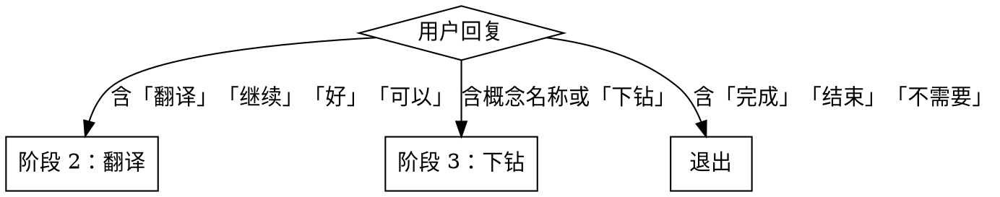

# lore — 渐进式阅读笔记

## Overview

将一篇文章转化为结构化中文阅读笔记，通过四个渐进阶段在 `reading/<slug>.md` 中持续产出可读文件。每个阶段**先写文件，再与用户交互**。

## When to Use

- 用户提供了文章的 URL 或本地 Markdown 文件路径
- 需要生成中文摘要、翻译或概念深度笔记

**不适用：** 用户只是询问文章内容，没有明确要建立笔记文件的意图。

## Workflow

### 阶段 0：初始化（自动执行，不等待用户）

1. **读取内容**
   - 输入以 `http://` 或 `https://` 开头 → 使用 `web_fetch` 抓取
   - 其他 → 使用 `Read` 工具读取本地文件

2. **提取标题**：从 `<h1>` 标签或 `# ` 行提取；无标题则从首段推断

3. **推导 slug**：标题小写，空格和特殊字符替换为 `-`，只保留字母/数字/连字符
   - `"LLM Wiki Pattern"` → `llm-wiki-pattern`
   - `"What Async Promised and What it Delivered"` → `what-async-promised`

4. **创建输出文件** `reading/<slug>.md`：

```markdown
# <文章标题>

> 原文：<输入的 URL 或文件路径>
> 整理日期：<YYYY-MM-DD>

---
```

完成后立即进入阶段 1，不要暂停。

---

### 阶段 1：摘要（自动执行）

生成结构化中文摘要并**追加写入**文件：

```markdown
## 摘要

### 一句话概括
<不超过 40 字，捕捉核心洞见>

### 核心论点
- <论点，3-7 条>

### 关键概念
- <概念名，3-8 个>

---
```

写入后在对话中展示摘要全文，然后询问：

> 摘要已写入 `reading/<slug>.md`。接下来：继续翻译 / 跳过直接下钻某概念 / 完成？

**阶段跳转：**



---

### 阶段 2：翻译（用户确认后）

逐段翻译，**追加写入**文件：

```markdown
## 翻译

**原文**
> <原文段落，保持原文不变>

**译文**
<中文翻译>

---
```

翻译要求：忠实原意，保留专有名词（首次出现可附原文），保持段落结构和标题层级。

写入后询问：想对哪些概念深度下钻？或说「完成」退出。

---

### 阶段 3：概念下钻（用户指定，可重复）

对用户指定的每个概念展开：**背景**（从何而来、解决什么问题）、**原理**（核心机制）、**与其他概念的关系**、**示例**（如适用）。

写入文件（若无 `## 深度笔记` 节则先创建该节）：

```markdown
## 深度笔记

### <概念名>

<深度展开内容>

---
```

每个概念写入后询问：还有其他概念要下钻吗？重复直到用户退出。

---

### 退出

用户说「完成」「结束」「不需要了」「好了」时告知：

> 笔记已完成，文件保存在 `reading/<slug>.md`。

然后停止，不再执行任何操作。

## Constraints

- 所有生成内容使用**中文**
- 只写入 `reading/` 目录，不修改其他文件
- 每阶段**先写文件**，再展示内容或提问
- 摘要总篇幅 ≤ 原文 20%
- 翻译以段落为单位，不拆散段落
- 概念下钻只聚焦用户指定的概念，不随意扩展
